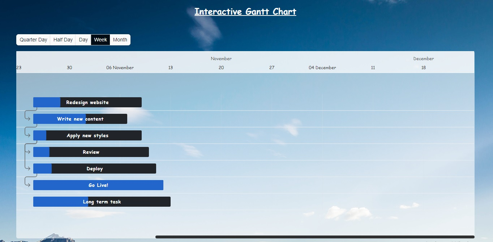

<div align="center">
    
    <h2>Frappe Gantt</h2>
    <p align="center">
        <p>A simple, interactive, modern gantt chart library for the web</p>
        <a href="#">
            <b>View the demo »</b>
        </a>
    </p>
</div>

<p align="center">
    <a href="#">
        
    </a>
</p>

### Install
```
npm install
```

### Run
```
npm run dev
```

### Usage
Include it in your HTML:
```
<link rel="stylesheet" href="dist/frappe-gantt.css" />
<script src="http://ajax.googleapis.com/ajax/libs/jquery/1.7.1/jquery.min.js" type="text/javascript"></script>
<script src="dist/frappe-gantt.js"></script>
<script src="dist/custom.js"></script>
```

And start hacking:
```js
var gantt_chart = new Gantt(".gantt-target", tasks, {
    custom_popup_html: function(task) {
        const start_date = task._start.toLocaleDateString();
        const end_date = task._end.toLocaleDateString();
        const timeA = new Date() - task._start;
        const timeB = (task._end - task._start) * task.progress / 100;

        return `
            <div class="details-container">
                <h4 class="title text-white">${task.name}</h4>
                <h4>Assignable Users: ${task.assignableUsers ? task.assignableUsers.map((user) => ` ${user}`) : 'No available'}</h4>
                <p>Expected to finish by ${task.ETADate}</p>
                <p>Start Day: ${start_date}</p>
                <p>End Day: ${end_date}</p>
                <p>Status: ${task.cancelled ? 'Cancelled' : task.progress === 100 ? 'Completed': timeA > timeB ? 'Late' : 'Ontime'}</p>
            </div>
        `;
    },
    view_mode: 'Week',
    language: 'en'
});
```

You can input your data in dist/custom.js file:
```js
var tasks = [
    {
        start: '2021-10-25',            // start day
        end: '2021-11-08',              // end day
        name: 'Redesign website',       // milestone name
        id: "Task 0",                   // milestone ID
        progress: 25,                   // project progress
        assignableUsers: [              // assignable users
            'Jack',
            'John',
            'Jane'
        ],
        cancelled: false                // project cancel flag
    },
    {
        start: '2021-10-25',
        end: '2021-11-06',
        name: 'Write new content',
        id: "Task 1",
        progress: 56,
        dependencies: 'Task 0',
        cancelled: false
    },
    {
        start: '2021-10-25',
        end: '2021-11-08',
        name: 'Apply new styles',
        id: "Task 2",
        progress: 12,
        dependencies: 'Task 1',
        assignableUsers: [
            'Smith',
            'John',
            'Micle'
        ],
        cancelled: false
    },
    ...
]
```

License: MIT

------------------
